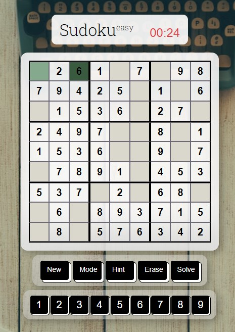

# Sudoku 

## Description 
- React app that serves react-redux commands on a single webpage. 
- Website link: sudoku-react-berk.herokuapp.com/

## Functionality 
- Buttons:
    - New: Create new game.
    - Mode: Create new game with selected difficulty.
    - Hint: Get next solution to focused input cell or next input cell that is currently incorrect/empty.
    - Erase: Delete value of currently selected cell.
    - Number Pad: Input value in currently selected cell.
    - Solve: Generate solution to current game.

## New Features:
- Use of arrow keys to move focused cell. 
- Use keyboard number pad to input values, backspace key and delete key to delete values in focused cell. 

## References 
- Hosted on [Heroku](https://www.heroku.com/)
- Uses [react-mousetrap](https://github.com/telecta/react-mousetrap) API for keyboard actions
